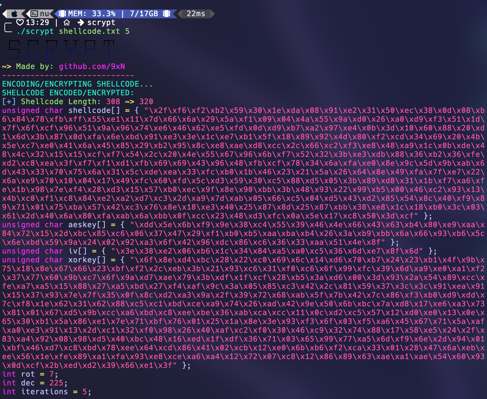

# SCRYPT: An Introduction to Shellcode Encoding && Encryption

## Introduction
SCRYPT is a simple shellcode encryptor/encoder that uses the OpenSSL library to encrypt a shellcode using the AES-256-CBC encryption algorithm then applies several encoding techniques to obfuscate a given shellcode file. This encrypted/encoded shellcode can be used for both legitimate and malicious purposes, such as exploiting system vulnerabilities or executing arbitrary code. 

## Pre-requisites
To compile and run this program, you will need to have `lcrypto` installed on your system. You can install it using the following command:
Linux:
```bash
sudo apt-get install openssl
sudo apt-get install libssl-dev
```
Windows:
To install OpenSSL on Windows, you can follow these steps:

1. Download the OpenSSL binary package from the official website. You can download the package from the following link: https://www.openssl.org/community/binaries.html

2. Choose the appropriate version of OpenSSL based on your system architecture (32-bit or 64-bit) and the version of your operating system.

3. Install the OpenSSL binary package by running the downloaded executable file and following the installation wizard.

4. After installation, add the OpenSSL `bin` directory to your system's `PATH` environment variable. This will allow you to run OpenSSL commands and use the OpenSSL library in your C programs.

To add the OpenSSL `bin` directory to your `PATH` environment variable, you can follow these steps:

1. Open the Windows Control Panel.

2. Click on "System and Security", then click on "System".

3. Click on "Advanced system settings".

4. Click on the "Environment Variables" button.

5. In the "System Variables" section, scroll down and select the "Path" variable, then click on the "Edit" button.

6. Add the path to the OpenSSL `bin` directory to the end of the "Variable value" field, separated by a semicolon. For example, if OpenSSL is installed in `C:\OpenSSL-Win64\bin`, you would add `;C:\OpenSSL-Win64\bin` to the end of the "Variable value" field.

7. Click "OK" to save your changes.


MacOS:
To install OpenSSL on MacOS, you can follow these steps:

1. Install Homebrew, which is a package manager for macOS. You can install Homebrew by opening a Terminal window and running the following command:

```
/bin/bash -c "$(curl -fsSL https://raw.githubusercontent.com/Homebrew/install/HEAD/install.sh)"
```

2. Once Homebrew is installed, you can install OpenSSL by running the following command in the Terminal:

```
brew install openssl
```

3. After installation, add the OpenSSL `bin` directory to your system's `PATH` environment variable. This will allow you to run OpenSSL commands and use the OpenSSL library in your C programs.

To add the OpenSSL `bin` directory to your `PATH` environment variable, you can follow these steps:

1. Open the Terminal.

2. Type the following command to open the `.bash_profile` file:

```
nano ~/.bash_profile
```

3. Add the following line to the file:

```
export PATH="/usr/local/opt/openssl/bin:$PATH"
```

4. Press `Ctrl+X` to exit nano, then press `Y` to save the changes.

5. Run the following command to apply the changes:

```
source ~/.bash_profile
```

## Compiling
To compile the program, use the following command:
```bash
gcc -o scrypt scrypt.c -lcrypto -lssl
```
IF THAT DOES NOT WORK TRY THIS:

```bash
gcc -o scrypt scrypt.c -I/usr/local/opt/openssl/include -L/usr/local/opt/openssl/lib -lcrypto -lssl
```

## Usage
To use this program, run the following command:
```
./scrypt <shellcode_file> <num_iterations>
```
Where `shellcode_file` is the name of the file containing the shellcode to be encrypted/encoded (note: this can have any file extension).
&& `num_iterations` is the number of times the shellcode will be encoded (note: this must be a positive integer).
After running the program, the encrypted/encoded shellcode will be written to your terminal in C-style format. You can copy and paste this encrypted/encoded shellcode into your own C program and use it for your own purposes. An example decoder is provided in the `decoder.c` file, where the user can copy paste the encrypted/encoded shellcode into the allocated space at the top of the file and run the program to decrypt/decode the shellcode and store it inside of the `decrypted_shellcode` unsigned char variable (you can compile this program the same way as SCRYPT but in the template decoder provided you do not need to provide any arguments).

## Encryption Algorithm
The code uses the OpenSSL library to encrypt a shellcode using the AES-256-CBC encryption algorithm. 
A random key and initialization vector (IV) are generated using the OpenSSL library's RAND_bytes() function.
An EVP_CIPHER_CTX context object is created using the OpenSSL library's EVP_CIPHER_CTX_new() function to hold the encryption state.
The encryption algorithm is initialized using the EVP_EncryptInit_ex() function, which takes the encryption context, the AES-256-CBC cipher object, the key, and the IV as parameters.
The EVP_EncryptUpdate() function is used to encrypt the input shellcode using the initialized encryption context. The encrypted shellcode is written to a buffer called ciphertext.
The EVP_EncryptFinal_ex() function is called to finalize the encryption process and write any remaining bytes to the ciphertext buffer.
The encryption context is freed using the EVP_CIPHER_CTX_free() function.

## Encoding Techniques
SCRYPT uses the following encoding techniques to obfuscate the shellcode:
* **XOR Encoding**: SCRYPT generates a random XOR key of the same size as the shellcode and applies XOR operation to each byte of the shellcode with a corresponding byte of the XOR key. This technique can make it harder for antivirus software to detect the shellcode.
* **ROT Encoding**: SCRYPT generates a random number between 1 and 8 and performs a rotation (shift) operation on each byte of the shellcode by that amount. This further obfuscates the shellcode.
* **DEC Encoding**: SCRYPT subtracts a random value from each bit of the shellcode to produce a decimal representation of the original value. This encoding technique is also known as decimal encoding or decimalization.
* **NOT Encoding**: SCRYPT iterates over the bytes of the input data and applies the bitwise negation (~) operator to each byte. This operation flips the bits of the byte, changing 0s to 1s and vice versa. The result is a transformed version of the original shellcode.

## Shellcode Payloads
A shellcode is a small piece of code that is designed to perform a specific task or execute arbitrary code when injected into a vulnerable process or system. Shellcode payloads can be used for both legitimate and malicious purposes, depending on the context and intent of the user.

## Screenshots
Two screenshots of SCRYPT in action are provided below:




## Conclusion
SCRYPT provides an introduction to shellcode encoding and demonstrates some basic encoding techniques that can be used to obfuscate shellcode payloads. However, it is important to note that the use of shellcode for malicious purposes is illegal and can result in severe consequences. This program should only be used for educational or research purposes, and not for any malicious activities.